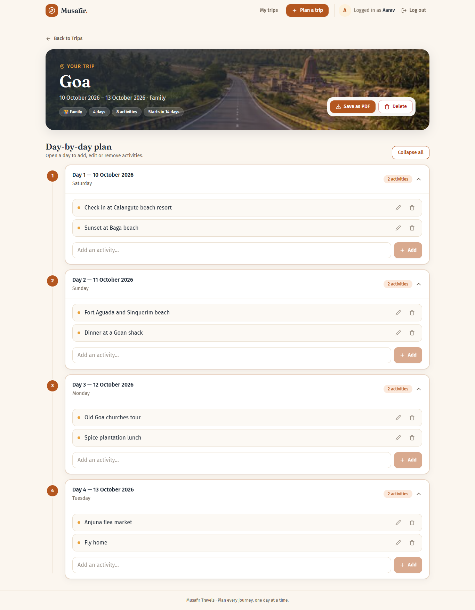
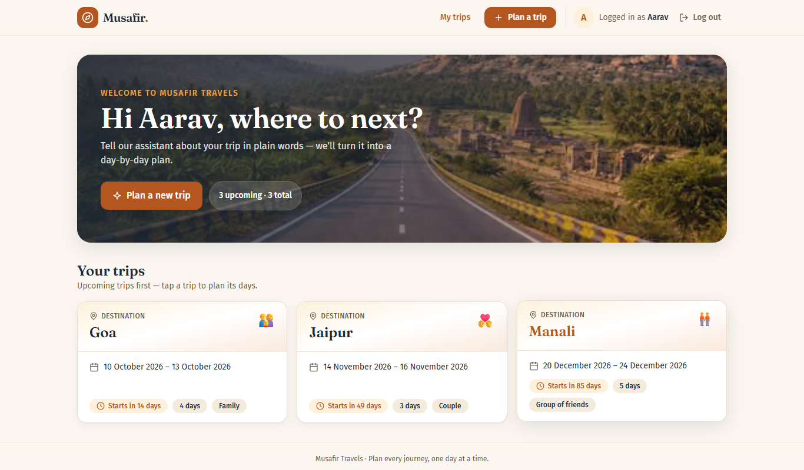
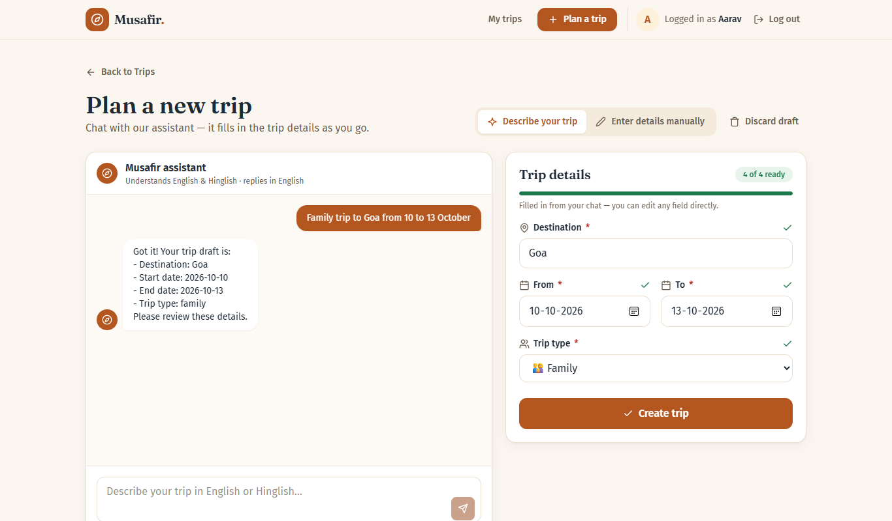
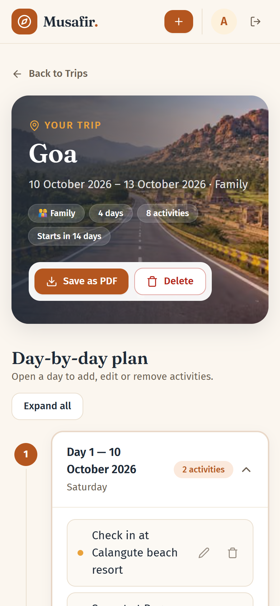
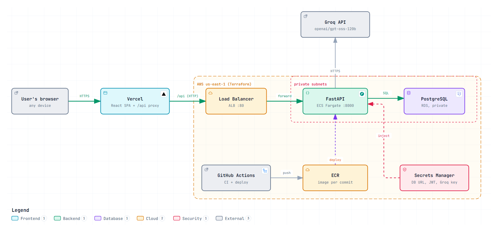
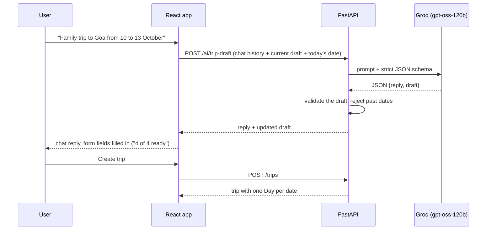

# Musafir Travels — AI-Assisted Trip Planner

Plan a trip by describing it in plain English (or Hinglish). An AI assistant turns your message into a trip draft (destination, dates and trip type) for you to review. You then plan each day and save the itinerary as a PDF.



---

## Contents

- [Why this project](#why-this-project)
- [Key features](#key-features)
- [Screenshots](#screenshots)
- [Tech stack](#tech-stack)
- [Architecture](#architecture)
- [How it works](#how-it-works)
- [Project structure](#project-structure)
- [Run it locally](#run-it-locally)
- [Configuration](#configuration)
- [API](#api)
- [Testing](#testing)
- [Deployment](#deployment)
- [Future improvements](#future-improvements)

## Why this project

Travellers usually spread their plans across notes apps, spreadsheets and chat threads, which makes an itinerary hard to keep organised and hard to use on the road. Musafir keeps each trip in one place, with one card per day, and produces a clean PDF when the plan is done.

## Key features

| Feature | Details |
|---|---|
| **Accounts** | Sign up and log in with a username and password. Passwords are hashed with bcrypt and sessions use a JWT, so you stay logged in after a page refresh. |
| **AI trip assistant** | Describe your trip in English or Hinglish, e.g. "family trip to Goa from 10 to 13 October". The assistant fills in the destination, dates and trip type, asks for anything missing, and waits for you to confirm. |
| **Manual entry** | A form is always available instead of the chat, with the same checks. |
| **Day-by-day plan** | Creating a trip generates one day for every date in its range. Open a day to add, edit or delete activities. |
| **Save as PDF** | Downloads a clean day-by-day itinerary, generated in the browser. |
| **Trip list** | Upcoming trips come first, with "Starts in N days", "Happening now" and "Completed" badges. |
| **Friendly limits** | If the AI is busy (HTTP 429), the chat shows a countdown and keeps your conversation. Past dates are rejected with a clear message. |
| **Drafts survive a refresh** | An unfinished AI conversation is saved in the browser until you create the trip or log out. |
| **Responsive** | Works on desktop and mobile browsers. |

## Screenshots

| Log in | Your trips |
|---|---|
|  |  |

| AI assistant filling in the trip | Mobile view |
|---|---|
|  |  |

## Tech stack

| Layer | Technology | Why |
|---|---|---|
| Frontend | **React 19, TypeScript, Vite** | Typed components and fast builds |
| Styling | **Tailwind CSS v3** | Shared design tokens and component classes |
| Data fetching | **TanStack Query** | Caching, loading and error states, cache refresh after changes |
| Routing | **React Router 7** | `/login`, `/signup`, `/trips`, `/trips/new`, `/trips/:id` |
| PDF | **jsPDF** | Builds the itinerary PDF in the browser; the server isn't involved |
| Backend | **FastAPI (Python 3.12)** | Typed request and response models, automatic OpenAPI docs |
| ORM and migrations | **SQLAlchemy 2.0, Alembic** | Database models and versioned schema changes |
| Auth | **PyJWT, passlib/bcrypt** | Stateless tokens and hashed passwords |
| Database | **PostgreSQL 16** | Docker locally, Amazon RDS in production |
| AI | **Groq, `openai/gpt-oss-120b`** | Fast inference with strict JSON-schema output |
| Infrastructure | **Terraform on AWS**: VPC, ALB, ECS Fargate, RDS, ECR, Secrets Manager, IAM OIDC | Infrastructure defined in code and reproducible |
| Frontend hosting | **Vercel** | HTTPS hosting for the frontend; `/api/*` is proxied to AWS |
| CI/CD | **GitHub Actions** | Tests on every push; builds and deploys on the release branch |
| Testing | **pytest, Vitest, Testing Library, oxlint** | Backend and frontend tests, plus linting |

## Architecture



- The **browser** only talks to **Vercel** over HTTPS. Vercel serves the React app and forwards `/api/*` requests to the AWS load balancer.
- **FastAPI** runs as a container on **ECS Fargate** in private subnets. It checks the JWT on every trip and AI request.
- **PostgreSQL on RDS** sits in private subnets and accepts connections only from the ECS service.
- **Secrets Manager** supplies the database URL, the JWT secret and the Groq key to the container when it starts. No secrets are in the code or the image.
- **GitHub Actions** signs in to AWS through **OIDC**, so there are no stored AWS keys. It pushes an image tagged with the commit to **ECR** and rolls it out to ECS.

## How it works

### Creating a trip with the AI assistant



- **Structured output.** The model must answer in a strict JSON schema, and Groq enforces it while generating, so every reply parses reliably (about 1.7 s per turn).
- **Swappable provider.** The model is called through a small `ProviderAdapter` interface, so tests replace Groq with a fake and never touch the network.
- **Rate limits.** When Groq or the per-user limit returns 429, the API passes `Retry-After` through to the browser, which shows a countdown.
- **The user stays in control.** The draft is only a suggestion. Nothing is saved until the user presses **Create trip** or confirms in the chat.

### Data model

`User` → `Trip` (destination, start and end date, trip type) → `Day` (day number, date) → `Activity` (free text, sort order). Deleting a trip deletes its days and activities. Asking for another user's trip returns **404**, so the API doesn't reveal that the trip exists.

## Project structure

```
trip-planner/
├── backend/                 FastAPI service
│   ├── app/
│   │   ├── main.py          app, CORS, /api/v1 routers, /health
│   │   ├── models.py        User, Trip, Day, Activity
│   │   ├── routers/         auth, trips, activities, ai
│   │   ├── schemas/         pydantic request/response models
│   │   └── services/        auth, AI service, prompts, Groq adapter
│   ├── alembic/             database migrations
│   ├── tests/               pytest suite (69 tests, needs Postgres)
│   └── Dockerfile
├── frontend/                React + TypeScript app
│   ├── src/
│   │   ├── api/             fetch client and TanStack Query hooks
│   │   ├── auth/            AuthContext, protected routes
│   │   ├── components/      TripChat, TripDraftReview, DayPlanner, ...
│   │   ├── hooks/           draft persistence for the AI chat
│   │   └── pages/           Home, NewTrip, TripItinerary, Login, Signup
│   └── vercel.json          SPA routing + /api proxy
├── infra/                   Terraform
│   ├── environments/prod/   root module
│   ├── modules/             network, alb, ecs, database, ecr, iam-oidc, cdn
│   └── scripts/             backup, destroy, restore
├── specs_new/               product, API, backend, frontend and AI specs
├── docs/                    architecture diagram, screenshots
└── .github/workflows/       ci.yml, deploy.yml
```

## Run it locally

**You need:** Python 3.12, Node.js 22 or 24, and Docker (for Postgres).

**1. Start the database**

```bash
docker run -d --name musafir-postgres -p 5432:5432 \
  -e POSTGRES_USER=musafir -e POSTGRES_PASSWORD=musafir -e POSTGRES_DB=musafir postgres:16
```

**2. Start the backend**

```bash
cd backend
python -m venv .venv
source .venv/bin/activate          # Windows: .venv\Scripts\activate
pip install -r requirements.txt
cp .env.example .env               # Windows: copy .env.example .env
alembic upgrade head
uvicorn main:app --reload
```

The API runs at http://localhost:8000/api/v1, with interactive docs at http://localhost:8000/docs.

**3. Start the frontend**

```bash
cd frontend
npm install
npm run dev
```

Open http://localhost:5173 and create an account.

> **Enable the AI assistant locally:** create a Groq API key at console.groq.com, then set `AI_ENABLED=true` and `AI_API_KEY=<your key>` in `backend/.env` and restart the backend. Without a key, the manual entry form still works.

## Configuration

**Backend** (`backend/.env`, copied from `backend/.env.example`):

| Variable | Purpose | Default |
|---|---|---|
| `DATABASE_URL` | PostgreSQL connection string | local Docker DB |
| `CORS_ORIGINS` | Frontend origins allowed to call the API, comma-separated | `http://localhost:5173` |
| `JWT_SECRET` | Secret used to sign login tokens | **change this in production** |
| `JWT_EXPIRY_MINUTES` | How long a login token lasts | `43200` (30 days) |
| `AI_ENABLED` | Turns the AI assistant on or off | `false` |
| `AI_PROVIDER` / `AI_MODEL` | `groq` / `openai/gpt-oss-120b` | |
| `AI_API_KEY` | Groq API key | empty |
| `AI_TIMEOUT_SECONDS` | Time limit for each AI request | `20` |

**Frontend** (`frontend/.env`): `VITE_API_BASE_URL` is `http://localhost:8000/api/v1` locally and `/api/v1` in production, where it goes through the Vercel proxy.

In production, secrets live in **AWS Secrets Manager** and are never committed.

## API

All routes are under `/api/v1`. Every route except signup and login needs `Authorization: Bearer <token>`.

| Method | Route | Description |
|---|---|---|
| `POST` | `/auth/signup` | Create an account → token |
| `POST` | `/auth/login` | Log in → token |
| `GET` | `/trips` | List your trips |
| `POST` | `/trips` | Create a trip (generates one day per date) |
| `GET` | `/trips/{id}` | Trip with its days and activities |
| `DELETE` | `/trips/{id}` | Delete a trip |
| `POST` | `/trips/{id}/days/{day_id}/activities` | Add an activity |
| `PATCH` | `/activities/{id}` | Edit an activity |
| `DELETE` | `/activities/{id}` | Delete an activity |
| `POST` | `/ai/trip-draft` | Chat turn → assistant reply + updated trip draft |
| `GET` | `/health` | Health check (outside `/api/v1`) |

**Error codes:**
- **400:** a business rule was broken, such as an end date before the start date, a past start date or empty activity text.
- **422:** the request is malformed.
- **404:** the resource doesn't exist or belongs to another user.
- **429:** a rate limit was hit; the response includes `Retry-After`.
- **502, 503, 504:** the AI provider had a problem.

## Testing

```bash
cd backend  && pytest                                   # needs the local Postgres
cd frontend && npm test && npm run lint && npm run build
```

| Check | Result |
|---|---|
| Backend: pytest (auth, trips, activities, AI endpoint, Groq adapter) | **69 passed** |
| Frontend: Vitest + Testing Library | **8 passed** |
| Frontend: oxlint | 0 errors (2 known warnings) |
| Frontend: `tsc` + Vite production build | passes |
| CI: Alembic `upgrade head` → `downgrade base` round-trip | passes on every push |

The Groq tests mock the SDK, so the suite never calls the network. The deployed app has also been tested by hand: sign-up and login, staying logged in after a refresh, creating trips with the AI and by hand, rejecting past dates, the rate-limit countdown, editing activities, and Save as PDF.

## Deployment

| Part | Where | How |
|---|---|---|
| Frontend | Vercel | Builds automatically on every push |
| Backend | AWS ECS Fargate | GitHub Actions tests the code, builds the image, runs database migrations and rolls out the new version |
| Infrastructure | Terraform | All AWS resources are defined in `infra/` |

GitHub Actions signs in to AWS through OIDC, so no AWS keys are stored in GitHub.

## Future improvements

- **CloudFront and a custom domain:** HTTPS all the way to AWS (the Terraform module is already written)
- **Email accounts:** email sign-up, verification and password reset
- **Shareable itineraries:** a read-only link for travel companions
- **Activity suggestions:** AI-suggested activities for each day, based on destination and trip type
- **Multi-destination trips:** several stops in one trip, each with its own dates
- **Scaling:** a shared rate-limit store (e.g. Redis) and autoscaling for the backend
- **Faster loading:** split the frontend bundle so each page loads only the code it needs

---

Built by [@Nima168](https://github.com/Nima168) as a project for the Agentic AI course at IISc.
